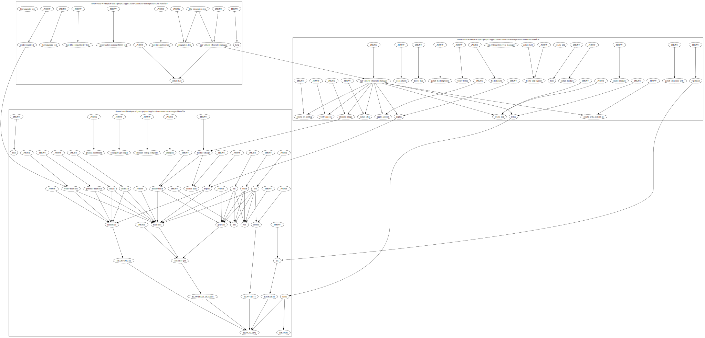

# Makedot

Util for making dot graphs from Makefiles, with support for `make` command inside.

Example call inside [`application-connector-manager`](https://github.com/kyma-project/application-connector-manager/blob/main/hack/ci/Makefile):
```
makedot ./hack/ci/Makefile | dot -T svg -o ./graph.svg
```



## Downloading binary
Binaries are attached to [releases](https://github.com/VOID404/makedot/releases/latest).
Direct downloads for various targets can be found under: `https://github.com/VOID404/makedot/releases/latest/download/makedot-x86_64-unknown-linux-gnu.tar.gz`

## Building from source
```sh
# optionally select tag with --branch v0.1.0 
git clone --depth 1 https://github.com/VOID404/makedot.git
cargo build --release
./target/release/makedot
```

Alternatively you can build inside docker:
```sh
docker build --output=./target/release .
./target/release/makedot
```
